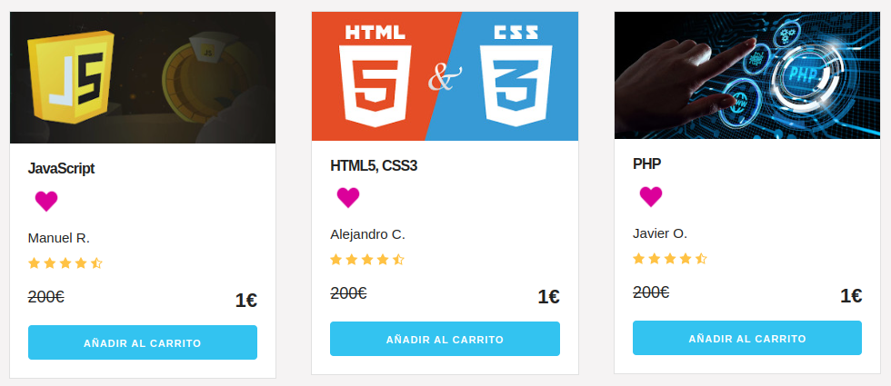

### WEB CURSOS ONLINE

**Descripción:** 
En esta actividad, he escogido el proyecto del carrito de curso ya que creo que quedaba básico y he implantado mejoras como IndexedDB, login de usuario, y cuentas de usuario con favoritos.

**Objetivos del proyecto**
- Ampliar funcionalidades: Identificar áreas de mejora en un proyecto existente y añadir nuevas funcionalidades utilizando eventos, DOM, formularios y almacenamiento en el navegador.
- Optimización de código: Mejorar el rendimiento y la eficiencia del código heredado, aplicando buenas prácticas de desarrollo y refactorización.
- Documentación clara: Mantener una documentación detallada de los cambios realizados, explicando las nuevas funcionalidades implementadas.
- Uso de sintaxis moderna: Demostrar el uso de las características modernas de JavaScript, para escribir un código limpio, eficiente y sostenible.

# Beneficios de Implementar IndexedDB, Login de Usuario y Favoritos

## 1. Persistencia de Datos Local
 **IndexedDB** permite almacenar datos de forma persistente en el navegador, incluso sin conexión a internet.
- Mejora la experiencia del usuario al mantener datos como el carrito de compras o favoritos disponibles sin necesidad de recargar desde un servidor.
- Cuenta con tres almacenes dentro de la base de datos para cada necesidad:
      - carrito
      - usuario
      - favoritos
  
  Esto hace que la estructura de datos sea más ordenada, mejora la eficiencia en la consulta y la manipulación de datos, además de una mejor escalabilidad y mantenimiento ya que a medida que se agregan nuevas funcionalidades o se amplían las características, se pueden crear o modificar almacenes sin afectar el resto de la aplicación.

  Además ofrece una experiencia de usuario más fluida y sin demoras, más seguridad en los datos y pueden acceder a su información de favoritos y al carrito incluso sin conexión a Internet.
  
## 2. Mejora de la Experiencia del Usuario
 **Login de usuario y Favoritos** permite a los usuarios marcar contenido o productos de interés para un fácil acceso posterior.
- La experiencia del usuario se vuelve más intuitiva y rica, facilitando la interacción con la aplicación.

## 3. Mejora en Seguridad y Gestión de Datos
- **Login de usuario** permite implementar prácticas de seguridad como autenticación segura y encriptación.
- Mejora el manejo de datos del usuario, cumpliendo con normativas de privacidad y protección de datos.

# Implementación visible

